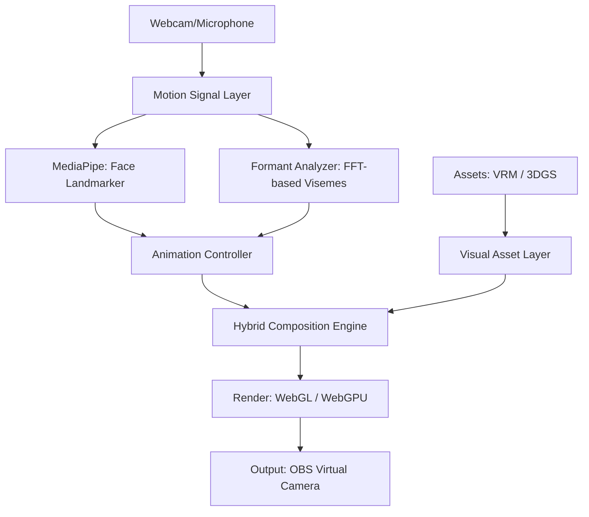

# StreamAvatar: Hybrid Neural Architecture Blueprint

## 1. Overview
StreamAvatar implementa un pipeline de producción virtual híbrido que combina gráficos vectoriales tradicionales (Mallas VRM) con técnicas emergentes de **Gráficos Neuronales** (3D Gaussian Splatting).

## 2. Decoupled Pipeline (AHA! Architecture)
Siguiendo los principios del paper *AHA! (Animating Human Avatars)*, el sistema separa la síntesis de movimiento de la representación visual.

## 3. Data-Driven Standardization (VRM)
Utilizamos el estándar VRM para desacoplar la geometría de la lógica de animación. Esto permite que cualquier modelo humanoide sea animado instantáneamente mediante el `Retargeting Bridge` que mapea señales ARKit a expresiones VRM.

## 4. Performance Optimization (TaoAvatar Style)
- **Lazy Loading**: Los activos pesados (3DGS) solo se cargan bajo demanda.
- **Worker-based Tracking**: La inferencia de IA ocurre fuera del hilo principal usando `SharedArrayBuffer`.
- **LRU Cache**: Gestión inteligente de memoria en IndexedDB para activos volumétricos.

---
*Este documento forma parte del dossier de arquitectura para la solicitud de fondos públicos 2026.*
