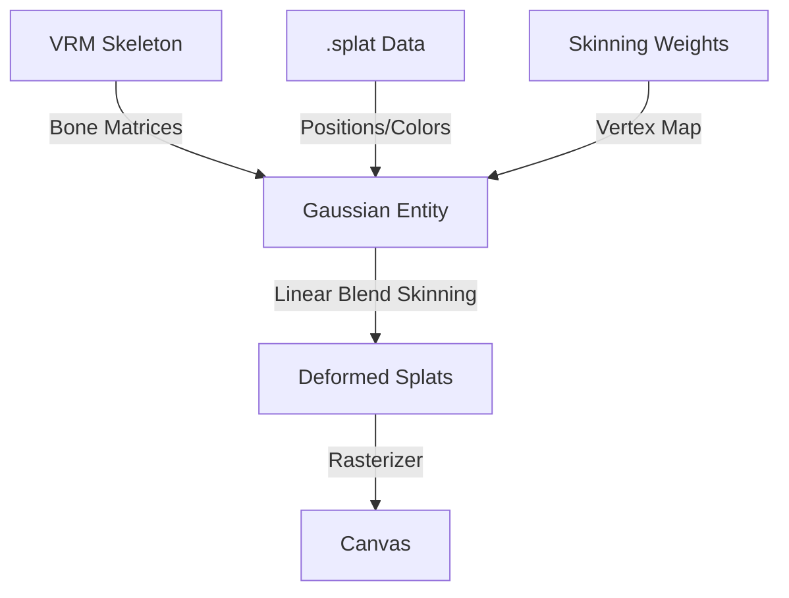

# Specification: Hybrid Neural Rendering (3DGS)

> **Status:** Draft  
> **Module Owner:** Neural Rendering Layer  
> **Dependencies:** `three` ^0.160, `@pixiv/three-vrm`  
> **Compliance:** Constitution §2 (Performance Guard)

---

## 1. Core Concept: "Neural Shell"

Integración de **3D Gaussian Splatting** anclado a la malla VRM existente para lograr hiperrealismo sin sacrificar la interactividad.



---

## 2. Input Data Contracts

### 📥 Hybrid Asset Format (`.hgs` concept)
Combinación de datos de splats estándar con datos de rigging.

| Data Stream | Format | Description |
|-------------|--------|-------------|
| **Splat Buffer** | `Float32Array` | Pos (3), Scale (3), Color (4), Rot (4) per splat. Standard .splat layout. |
| **Skinning Buffer** | `Uint16Array` | `BoneIndex` (4) + `Weight` (4) per splat. Matches VRM bone layout. |

> **Constraint:** Max 500k splats for mobile/web performance (SqueezeMe optimization).

---

## 3. Architecture: `GaussianEntity`

Implementa la interfaz `AvatarEntity` definida en `vrm-integration`.

```typescript
class GaussianEntity implements AvatarEntity {
  constructor(
    public vrm: VRM, // Reference for bone matrices
    public splatUrl: string,
    public skinningUrl: string
  ) {}

  update(delta: number) {
    // 1. Get current bone matrices from VRM
    // 2. Compute LBS (Linear Blend Skinning) for splat centers
    // 3. Update SplatShader uniforms/attributes
  }
  
  dispose() {
    // Clean up WebGL buffers
  }
}
```

---

## 4. Performance & Quality (LOD)

| Quality Level | Max Splats | Sorting Freq | Use Case |
|---------------|------------|--------------|----------|
| **Ultra** | 2M | Every Frame | RTX 4090 / M3 Max |
| **High** | 500k | Every 2 Frames | Desktop Standard |
| **Medium** | 100k | Every 5 Frames | Integrated GPU |
| **Low** | 50k | No Sorting | Mobile / Quest |

---

## 5. Privacy & Security
- **Local Rendering:** Todo el rasterizado ocurre en el cliente.
- **Asset Validation:** Misma validación de URL que el módulo VRM (SSRF protection).
