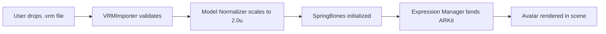

# Specification: VRM Integration Module

> **Status:** Draft  
> **Module Owner:** Visual Asset Layer  
> **Dependencies:** `@pixiv/three-vrm` ^2.0, `three` ^0.160  
> **Compliance:** Constitution §2 (Performance Guard)

---

## 1. Goals & User Journey

El sistema debe permitir a los usuarios cargar sus propios avatares `.vrm` (v0 y v1) y verlos animados en tiempo real mediante blendshapes faciales, sin configuración técnica manual.



---

## 2. Interface Contracts

### 📥 Input Contract

| Input | Type | Constraints |
|-------|------|-------------|
| **VRM Asset** | `.vrm` / `.glb` | Max 50MB soft limit, VRM 0.x/1.0 |
| **Polygon Budget** | Warning | UI alert if >100k triangles (Quest/Mobile) |
| **Skeleton** | Humanoid | Compatible con Mixamo/Unity Humanoid |
| **Tracking Data** | `BlendShapeData` | 52 ARKit coefficients (0.0-1.0) + Head Quaternion |

```typescript
interface BlendShapeData {
  /** 52 ARKit blendshape coefficients normalized 0.0-1.0 */
  coefficients: Float32Array;
  /** Head rotation as quaternion [x, y, z, w] */
  headRotation: [number, number, number, number];
  /** Timestamp in milliseconds */
  timestamp: number;
}
```

### 📤 Output Contract

| Output | Description |
|--------|-------------|
| **Normalized Model** | Three.js `Group` scaled to 2.0 units height |
| **SpringBones** | Physics system running at 60Hz fixed timestep |
| **ExpressionManager** | ARKit → VRM BlendShapeClips mapping |

```typescript
interface AvatarEntity {
  readonly model: THREE.Group;
  readonly vrm: VRM;
  
  /** Apply blendshape data to avatar expressions */
  applyBlendShapes(data: BlendShapeData): void;
  
  /** Update physics simulation */
  update(deltaTime: number): void;
  
  /** Cleanup all GPU resources */
  dispose(): void;
}
```

---

## 3. Expression Mapping (ARKit → VRM)

| ARKit Input | VRM Expression | Formula |
|-------------|----------------|---------|
| `jawOpen` | `Aa` | `jawOpen * 1.2` |
| `mouthSmileLeft/Right` | `Ee`, `Happy` | `(L + R) / 2 * 1.2` |
| `mouthPucker` | `Ou` | `pucker * 1.2` |
| `mouthFunnel` | `Oh` | `funnel * 0.8 + jawOpen * 0.3` |
| `eyeBlinkLeft/Right` | `Blink` | `max(L, R)` |

**Fallback:** Si el VRM carece de clips ARKit, usar interpolación básica (A, I, U, E, O, Blink).

---

## 4. Technical Constraints (Non-Negotiable)

| Constraint | Implementation |
|------------|----------------|
| **Async Loading** | `Suspense` + lazy import, no UI freeze |
| **Memory Management** | `dispose()` en geometrías, texturas, materiales al cambiar avatar |
| **Worker Isolation** | SpringBones physics puede ejecutarse en Web Worker |

> [!IMPORTANT]
> Al cambiar de avatar, se DEBE invocar `dispose()` para evitar memory leaks.

---

## 5. Verification Plan (TDD)

- [ ] `vrm-load-v0.test.ts`: Cargar VRM v0 y verificar render
- [ ] `vrm-load-v1.test.ts`: Cargar VRM v1 y verificar render  
- [ ] `blendshape-injection.test.ts`: Inyectar stream simulado, verificar vértices
- [ ] `memory-stability.test.ts`: Cargar/Descargar 10 veces, heap size estable
- [ ] `springbones-physics.test.ts`: Verificar actualización a 60Hz

---

## 6. File Mapping

| Responsibility | File |
|----------------|------|
| VRM Loading | `src/components/CustomModelAvatar.tsx` |
| ARKit→VRM Bridge | `src/lib/vrmTrackingBridge.ts` |
| Model Normalization | `src/lib/modelNormalizer.ts` |
| Expression Analysis | `src/hooks/useVisemeAnalyzer.ts` |

---

*Especificación SDD para agentes de IA y desarrolladores humanos.*
